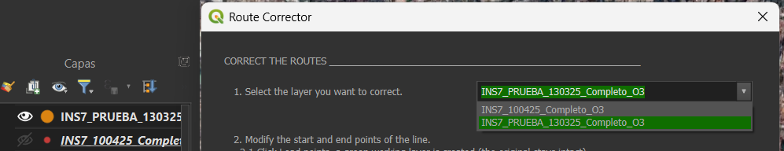

# RouteCorrector (QGIS Plugin)

**RouteCorrector** is a QGIS plugin designed to correct GPS drift in mobile air-quality and environmental monitoring datasets.  
It allows users to realign measurement points along predefined reference routes with high spatial precision, minimizing positional noise caused by GPS signal drift, rebound, or narrow-street interference.  

This tool was developed as part of a collaborative research initiative between the **Universidad Iberoamericana (Mexico)** and the **Universidad de Murcia (Spain)**, within projects on **micro-scale exposure assessment** and **mobile environmental sensing**.

---

## Purpose

Mobile monitoring campaigns using low-cost sensors often collect thousands of GPS-based data points that deviate slightly from the real walking or cycling path.  
These misalignments complicate spatial analyses, mapping, and statistical interpretation.

**RouteCorrector** solves this problem by projecting data points back onto the intended route while preserving either:
- The **temporal sequence** of measurements (Uniform Motion mode), or  
- The **observed spatial spacing** between points (Distance mode).

This ensures that every corrected dataset reflects the true spatial context of field measurements.

---

## Key Features (Version V1_SemFin_Din)

- **Two correction modes:**  
  - *Uniform Motion (MRU)*: preserves time intervals between points.  
  - *Distance-based*: preserves original distances between observations.  
- **Batch correction:** adjust an entire section between anchors in a single step.  
- **Interactive table tools:** remove unwanted points before or after correction.  
- **Optimized accuracy:** robust handling of GPS drift and short distance variability.  
- **Simplified workflow:** minimal configuration, focused on precision and reproducibility.  
- **Seamless QGIS integration:** runs directly within the QGIS interface, without external libraries or OSM dependencies.

---

## Methodological Context

The plugin implements a **parametric correction algorithm** that computes the proportional position of each observation along a selected line segment between two user defined anchor points.  
Depending on the chosen mode:
- The MRU mode distributes points evenly based on timestamp progression.  
- The Distance mode calculates cumulative observed distances to reproduce the actual spacing pattern along the corrected route.

This approach eliminates the need for external map matching (e.g. OpenStreetMap) and maintains the internal consistency of the original dataset.

---

## Requirements

- QGIS ≥ 3.22  
- Python ≥ 3.10  
- No external dependencies beyond the QGIS API (PyQt, QgsGeometry, math)

---

## Installation

1. Download the latest release ZIP from GitHub:  
   [Releases on GitHub](https://github.com/daperezmora/RouteCorrector/releases)
2. In QGIS, open **Plugins → Manage and Install Plugins → Install from ZIP**.  
3. Select the downloaded file `RouteCorrector-x.y.z.zip` and click **Install Plugin**.
4. Once installed, restart QGIS to ensure the plugin loads correctly.

---

## Usage

### Input requirements
- A **point layer** with GPS measurements (e.g., pollutants, timestamp, coordinates).
- A **reference route** (polyline) representing the intended path.  
  *You may draw it in QGIS or load it from an existing layer.*
- Recommended: fields for **timestamp** (for Uniform Motion) and **unique id**.

> CRS: Use a projected CRS (meters) for best distance calculations (e.g., UTM).  
> Save your project before running corrections.

### Quick start (6 steps)

1. **Load data**
   - Add your point layer (GPS measurements) and the reference route (polyline) to QGIS.
   - Ensure the point layer is visible in the Layers panel.

2. **Open the plugin**
   - Go to **Plugins → RouteCorrector → Open Dialog** (or use the toolbar button).

3. **Select the target layer (work on a copy)**
   - In the Layers panel, **duplicate your point layer** (Right-click → *Duplicate Layer*) and rename it (e.g., `points_corrected`).
   - **Select the copied layer** to make it active.
   - Click the **Toggle Editing** pencil on that copied layer to ensure edits apply to the copy.
     
                                    
4. **Define anchors**
   - Select the **start** and **end** anchor points (the section you want to correct).
   - Confirm that the selected segment on the route covers your points of interest.

5. **Choose a correction mode**
   - **Uniform Motion (MRU):** preserves **temporal progression** (even spacing by time).
   - **Distance-based:** preserves **observed spacing** between points (by cumulative distance).

6. **Run and export**
   - Click **Correct Section** to realign points along the reference route.
   - Review the table and optionally **remove unwanted points**.
   - **Save your edits** and **toggle editing off** on the copied layer.
   - Export the corrected result: **Right-click the layer → Export → Save Features As…**

> **Safety tip:** Always correct the **copied** layer (`points_corrected`) to keep your original measurements unchanged.

### Detailed workflow (additions)

- **Prepare layers (safe copy):** Right-click your original points → *Duplicate Layer* → rename (e.g., `points_corrected`). Make sure the **copied layer is active** and **editing is ON** (pencil icon) before running the correction.

- **Export & versioning:** After correction, save edits on `points_corrected`, then export to **GeoPackage (.gpkg)** or **GeoJSON** with a versioned name (e.g., `campaign_2024_points_corrected_v1.gpkg`).

---

## Authors and Contributions

- **Ana Laura Jimenez Chavez¹**, Lead developer and maintainer; implemented correction algorithms and QGIS integration.  
- **Francisco Esquembre Martinez²**, Conceptual design and mathematical modeling guidance.  
- **Daniel Alejandro Pérez de la Mora¹**, Interface design, usability testing, and documentation.  
- **Antonia Baeza Caracena³**, Validation, domain feedback, and critical review.

### Affiliations
1. Instituto de Investigación Aplicada y Tecnología, Universidad Iberoamericana, 01219 Mexico City, Mexico  
2. Department of Mathematics, Faculty of Mathematics, Campus de Espinardo, University of Murcia, 30100 Murcia, Spain  
3. Department of Chemical Engineering, Faculty of Chemistry, Campus de Espinardo, University of Murcia, 30100 Murcia, Spain  

---

## Citation

If you use **RouteCorrector** in academic or technical work, please cite as follows:

**APA**  
Jimenez Chavez, A. L., Esquembre Martinez, F., Pérez de la Mora, D. A., & Baeza Caracena, A. (2025). *RouteCorrector (QGIS Plugin)* [Computer software]. Universidad Iberoamericana & University of Murcia. https://github.com/daperezmora/RouteCorrector  

**IEEE**  
A. L. Jimenez Chavez, F. Esquembre Martinez, D. A. Pérez de la Mora, and A. Baeza Caracena, *RouteCorrector (QGIS Plugin)*, Universidad Iberoamericana & University of Murcia, 2025. [Online]. Available: https://github.com/daperezmora/RouteCorrector  

---

## License

This project is distributed under the terms of the  
[GNU General Public License v2 or later (GPL-2.0+)](LICENSE).

---

## Acknowledgments

This plugin is part of a collaborative research effort on **urban exposure assessment** and **environmental informatics**, supported by both institutions’ initiatives on air quality and sustainable mobility.
